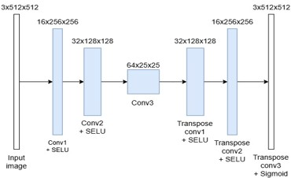
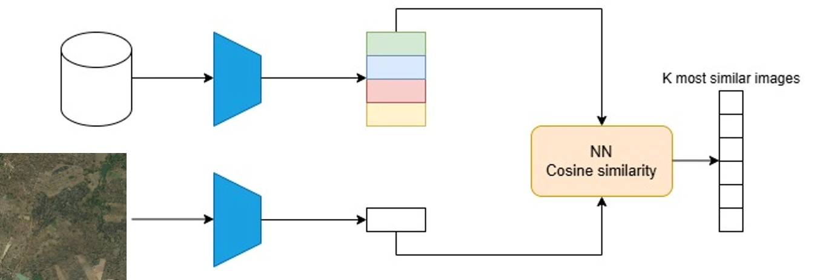

# satellite-imagery-retrieval

## Image retrieval
The image retrieval component was implemented following an unsupervised approach to retrieve, given an input satellite image, a list of the most similar images present in the training dataset. The system was built to search those images that contained istances of the classes present and a similar environment with respect to the input image.
The retreiaval component of our project is composed by two parts: in the frist part I built a convolutional autoencoder and I trained it on the whole training dataset to extract feature maps of all its images. This Convolutional Auntoencoder is composed by a combination of Convolutional Layers, SELU and Sigmoid activation functions.

In the second part we use a combination of Nearest Neighboor algotithm and histogram sililarities computation to retrieve, given a test image in input, the n most similar images into the training dataset.
After training, the decoder part was detached and the encoder was used to extract feature maps of the whole training dataset. By this way we built an embedding of dimension num_imagesx64x25x25.

During test, I used the same encoder to extract the feature map of a test image, and I applied Nearest Neighbour algorithm in order to find the top k similar images in the training dataset; the similarity was given by computing cosine similarity between the feature maps of both the input image and every image from the training dataset; then, to obtain a better result, for every image given in output by the Nearest Neighbour I computed the 3 color histograms (one for every RGB channel) and I computed KL divergence between them and the color histograms of input image. 
Finally, images were ordered using the value of the computed KL divergence, and I took the first n<k images with the most similar histograms to the input’s ones as the output of the retrrieval component. 

The Convolutoional Autoencoder was trained for 20 epoches on the whole dataset using Adam optimizer and Mean Squared Loss function. The final MSELoss value was 0.0037.
The Nearest Neighbour algorithm was used to retrieve the first k=50 similar images to the input, using cosine similarity to compare feature maps. Then I computed distance between color histograms using KL divergence, obtaining a ranking based on similarity between the k histograms and the input’s histograms. I took the first n=12 images from this ranked list. The histogram comparison has been added to improve the overoll result of the retrieval, exploiting the fact the usually similar environments are charaterized by similar color distributions. In our tests, I were able to succesfully perform satellite imagery retrieval using as input images with different types of environment, such as coltivarted fields, urban areas or range land.
